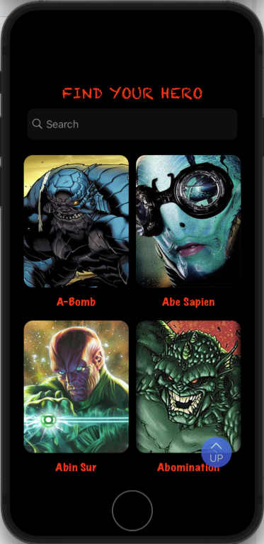
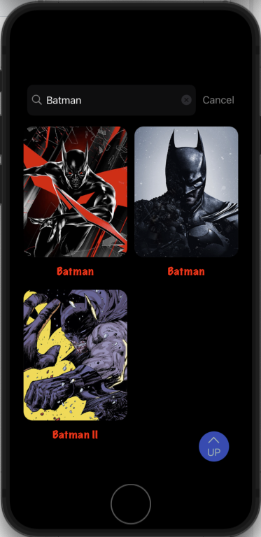
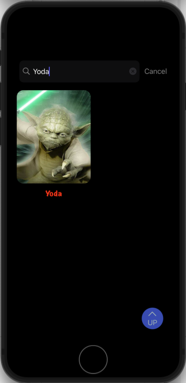
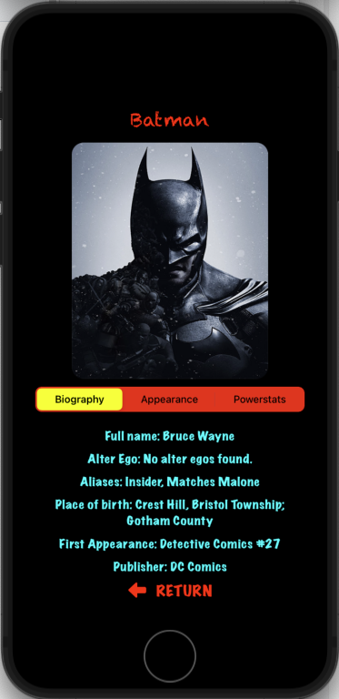
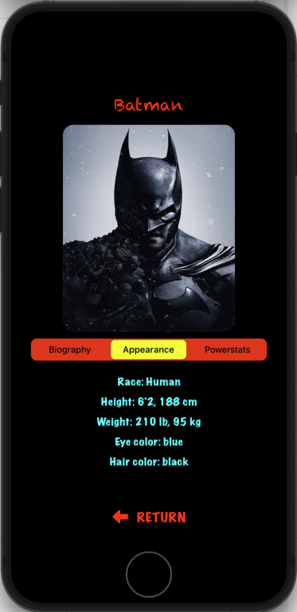
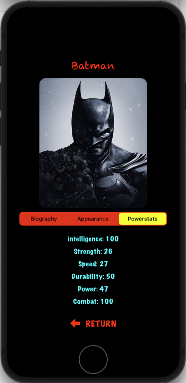
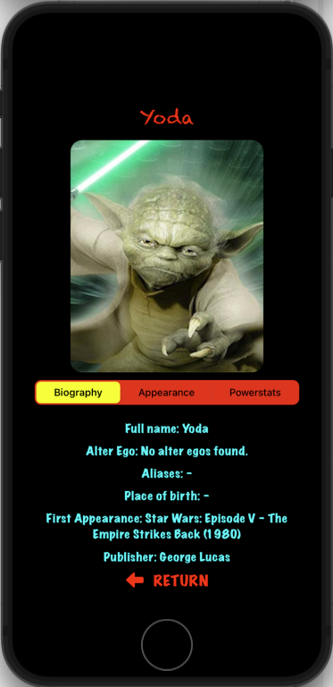
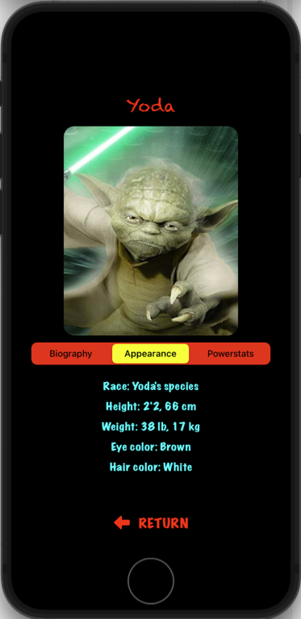
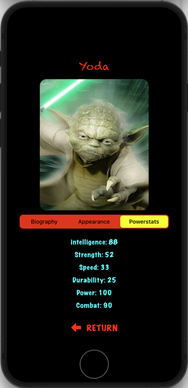

# HeroesApp

Весь UI написан програмно, без использования "storyboard" и "xib".

В приложении использовались такие элементы пользовательского интерфейса, как: 
UIlabel, UIButton, UIStackView, UINavigationController, UICollectionView, UISearchController, UISegmentedControl

Для загрузки данных из сети использовался **URLSession**

---

На главном экане рсаположены:
SearchBar - дял поиска супергероя по имени
CollectionView - отображение загруженных из сети данных (фото и имя)
Кнопка "UP" - при нажатии прокручивает весь контент в начальную позицию

  

 Экран детальной информации о супергерое:
 UIImage - отображение выбранного супергероя
 UISegmentedControl - переключение отображения данных супергероя (биография, внешний вид, показатели силы)
 можно прочитать краткую биографию, описание внешности, показатели силы

Информация о супергерое "Batman"

     

Информация о супергерое "Yoda"

     

Gif:
 
